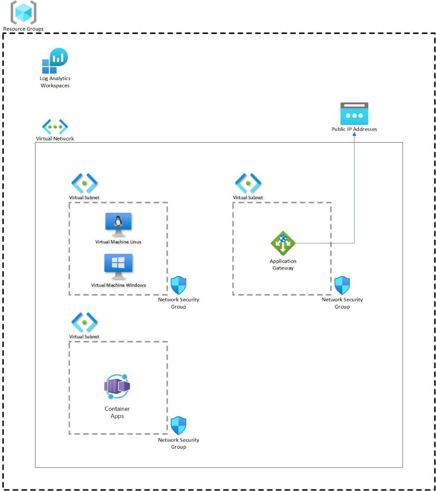

# **MicroHack Azure Monitor**

- [MicroHack introduction and context](#microhack-introduction-and-context)
- [Objectives](#objectives)
- [Prerequisites](#prerequisites)
- [Lab environment for this MicroHack](#lab-environment-for-this-microhack)
  - [Architecture](#architecture)
- [MicroHack Challenges](#microhack-challenges)
  - [Challenge 1 - Deploy the Lab environment](#challenge-1---deploy-the-lab-environment)
    - [Goal](#goal)
    - [Task 1: Deploy Baseline](#task-1-deploy-baseline)
    - [Task 2: Verify baseline](#task-2-verify-baseline)
- [Challenge 2 : Name..](#challenge-2--name)
    - [Goal](#goal-1)
    - [Task 1:](#task-1)
    - [Task 2:](#task-2)
    - [Task 3:](#task-3)
    - [Task 4:](#task-4)
- [Challenge 3 : Name ...](#challenge-3--name-)
    - [Goal](#goal-2)
    - [Task 1:](#task-1-1)
    - [Task 2:](#task-2-1)
    - [Task 3:](#task-3-1)
    - [Task 4:](#task-4-1)
- [Finished? Delete your lab](#finished-delete-your-lab)

# MicroHack introduction and context

This MicroHack scenario walks through the use of **Azure Monitor** with a focus on the best practices and the design principles. Specifically, this builds up to include working with an existing infrastructure.

This lab is not a full explanation of Kubernetes, Containers Apps etc. as a technology, please consider the following articles required pre-reading to build foundational knowledge.

Optional (read this after completing this lab to take your learning even deeper!)

Describe the scenario here...

# Objectives

After completing this MicroHack you will:

- Know how to build a ...
- Understand default ..
- Understand how ..

# Prerequisites

In order to use the MicroHack time most effectively, the following tasks should be completed prior to starting the session.

With these pre-requisites in place, we can focus on building the differentiated knowledge in ... that is required when working with the product, rather than spending hours repeating relatively simple tasks such as setting up....

In summary:

- Azure Subscription 
- Resource Group 
- Service 1
- Service 2  

Permissions for the deployment: 
- Contributor on your Resource Group
- Other necessary permissions

# Lab environment for this MicroHack

Explain the lab ..

## Architecture

At the end of this MicroHack your base lab build looks as follows:

# MicroHack Challenges 

## Challenge 1 - Deploy the Lab environment

### Goal 

The goal of this exercise is to deploy...

### Task 1: Deploy Baseline

We are going to use a predefined ARM template to deploy the base environment. It will be deployed in to *your* Azure subscription, with resources running in the your specified Azure region.

To start the ARM deployment, follow the steps listed below:

- Login to Azure cloud shell [https://shell.azure.com/](https://shell.azure.com/)
- Ensure that you are operating within the correct subscription via:

`az account show`

- Clone the following GitHub repository 

`git clone Link to Github Repo `

### Task 2: Verify baseline

Now that we have the base lab deployed, we can progress to the ... challenges!

# Challenge 2 : Name..

### Goal

### Task 1: 

### Task 2: 

### Task 3: 

**Explain the background...**

### Task 4: 

Before proceeding to challenge 3, ...

# Challenge 3 : Name ...

### Goal

### Task 1: 

### Task 2: 

### Task 3: 

**Explain the background...**

### Task 4: 

# Finished? Delete your lab

Thank you for participating in this MicroHack!
