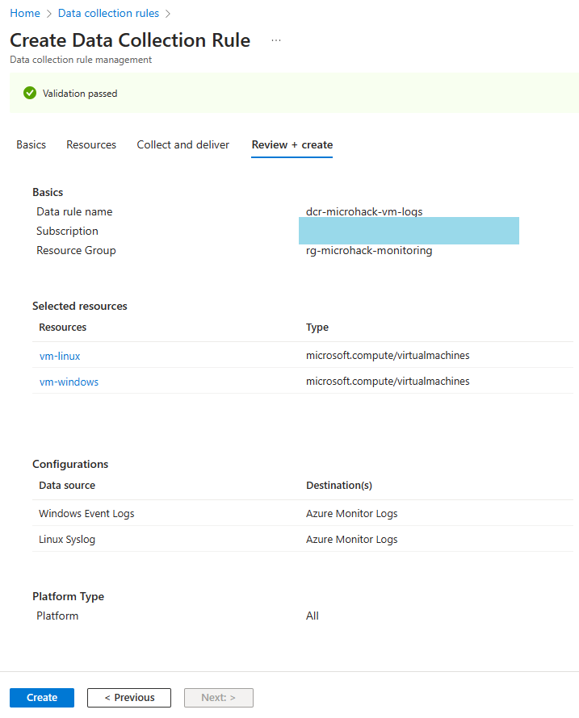

# Walkthrough Challenge  1

*Duration: 40 Minutes*

## Task 1 & 2 & 3

- Create a data collection rule
- For detailed information check [documenation page](https://learn.microsoft.com/en-us/azure/azure-monitor/agents/data-collection-rule-azure-monitor-agent?tabs=portal)

    

- Add resources and associate resources to the data collection rule.

    

- On the Collect and deliver tab, select Add data source to add a data source and set a destination. Select a Data source type.

    *Linux*
    

    *Windows*
    

- On the Destination tab, add `law-microhack`.

    *You can select multiple destinations of the same or different types. For instance, you can select multiple Log Analytics workspaces, which is also known as multihoming. You can send Windows event and Syslog data sources to Azure Monitor Logs only.*

    

- Select **Review + create** to review the details of the data collection rule and association with the set of virtual machines. Select **Create** to create the data collection rule.

    

- Verify Data Collection Rule configuration

    *Data Sources*
    

    *Resources*
    

    *VM Extensions + applications*
    

### Task 4: Validate tables in Log Analytics Workspace

- Which table includes Windows Events?
- Which table includes Linux Logs?
- Which table shows AMA reporting status?

### Task 5: Availability rate check

```powershell
Heartbeat
| summarize heartbeatPerHour = count() by bin_at(TimeGenerated, 1h, ago(24h)), Computer
| extend availablePerHour = iff(heartbeatPerHour > 0, true, false)
| summarize totalAvailableHours = countif(availablePerHour == true) by Computer
| extend availabilityRate = totalAvailableHours*100/24
| project-rename Availability_in_Percent=availabilityRate
```
