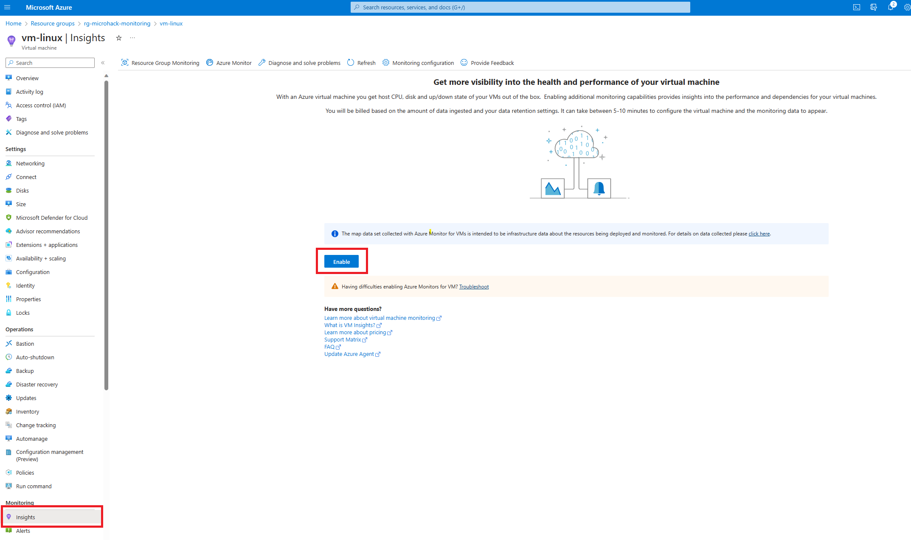
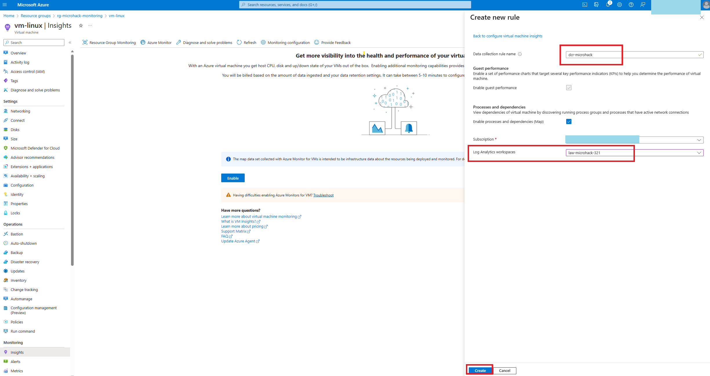
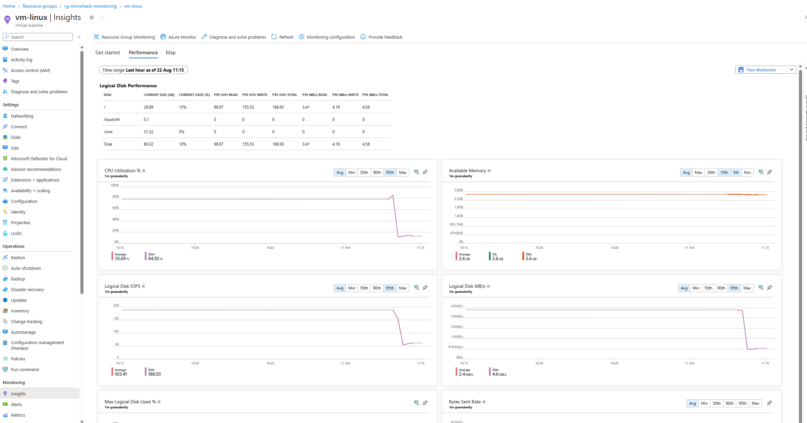
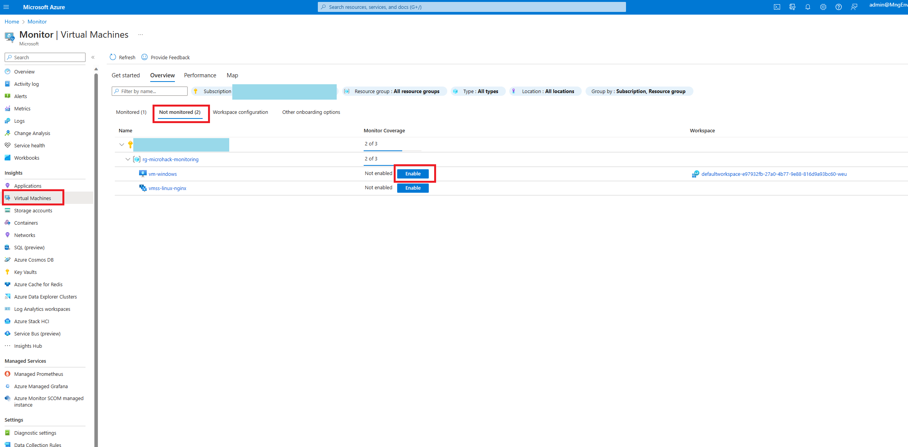
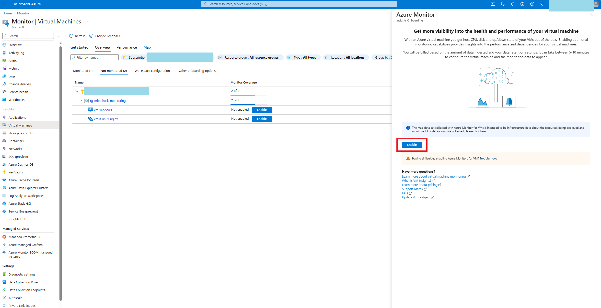

# Walkthrough Challenge 2

*Duration: 30 Minutes*

## Task 1: Enable VM Insights for `vm-linux`

- Enable VM Insights on monitored machines

    

- Create a Data Collection Rule and configure to use the Log Analytics Workspace and enable processes and dependencies (Map)

    

    

- View Performance tab after successful deployment

    

## Task 2: Enable VM Insights on unmonitored `vm-windows`

- From Azure Monitor blade there is a way to enable VM Insights, too.
- From the Monitor menu in the Azure portal, select Virtual Machines > Overview > Not Monitored.

    

    

    

    

## Task 3: Enable VM Insights for `vmss-linux-nginx` automatically

- Enable VM Insights for th VMSS by using Azure Policy
- VM insights policy initiatives install Azure Monitor Agent and the Dependency agent on new virtual machine scale set in your Azure environment.
- Assign these initiatives to the resource group `rg-monitoring-microhack` to install the agents on the virtual machines in the defined scope automatically.

## Task 4: Log search and visualize
