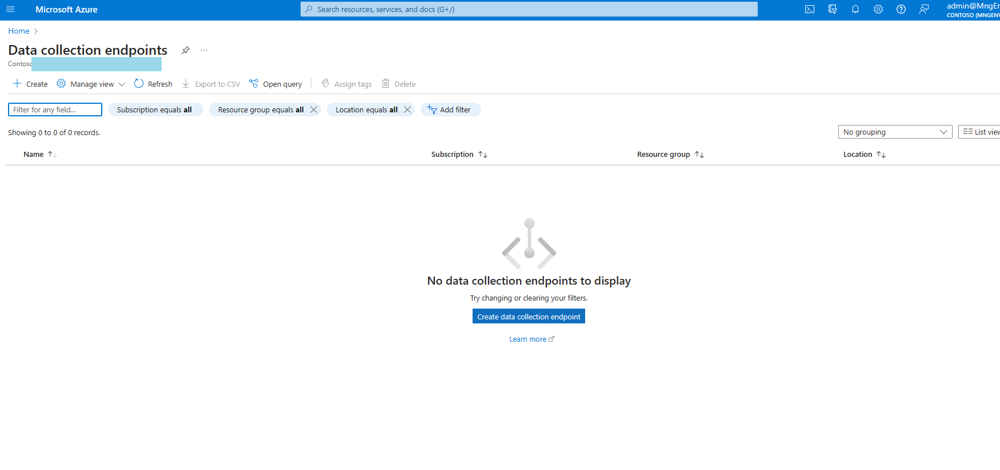
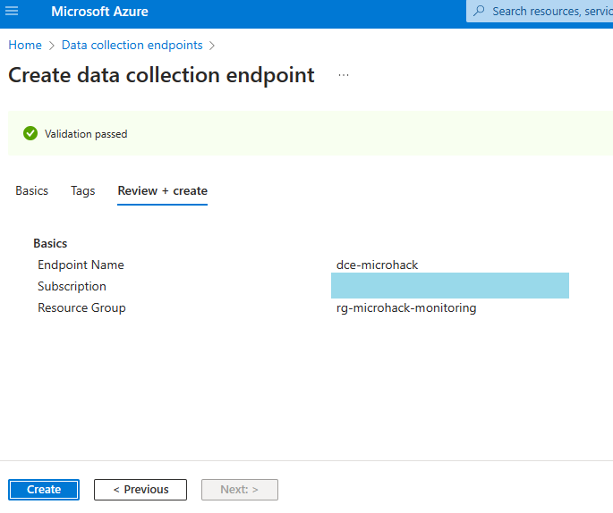
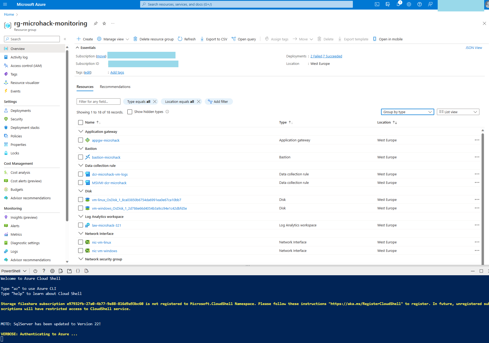
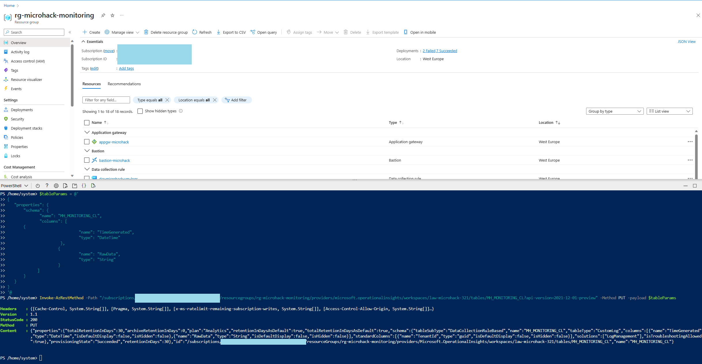
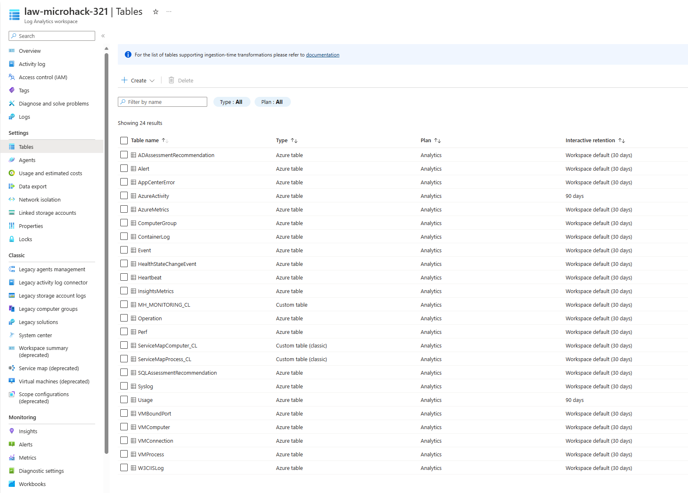
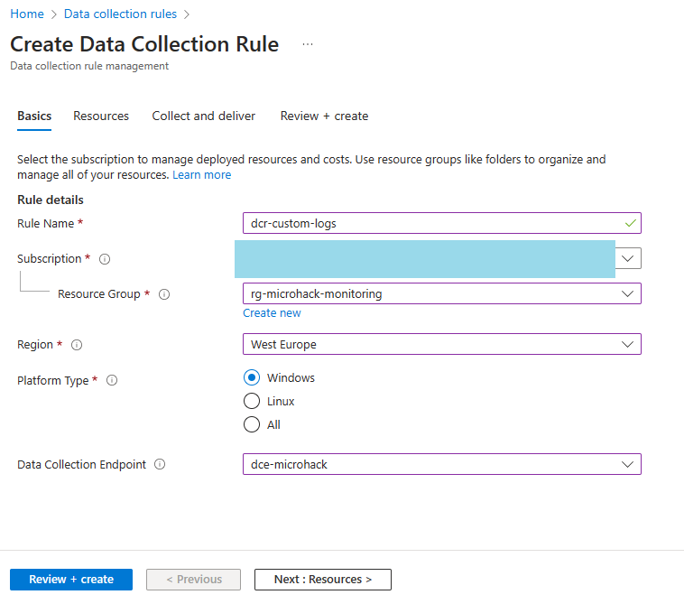
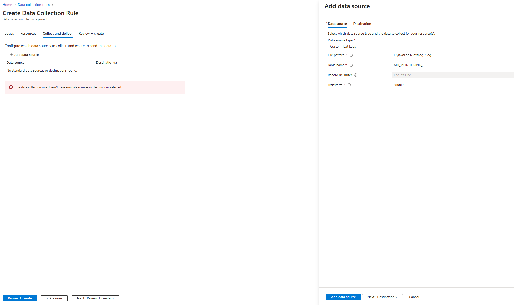
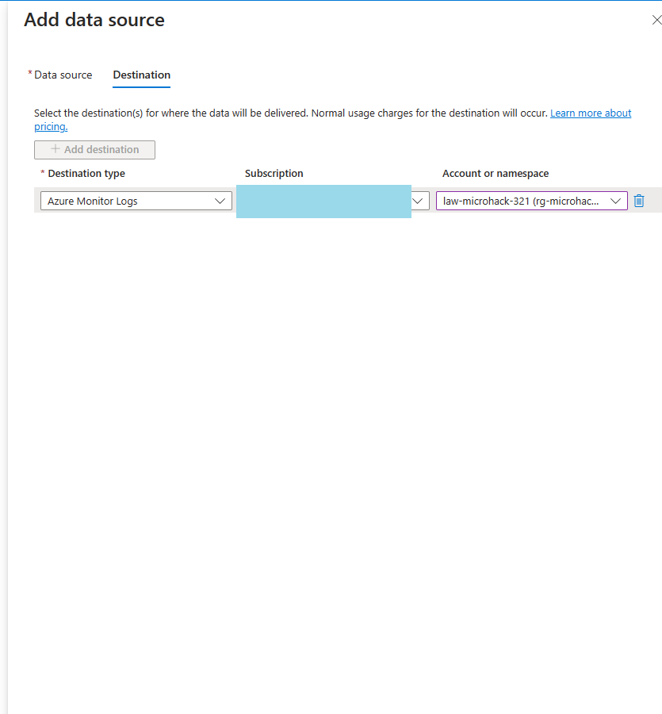
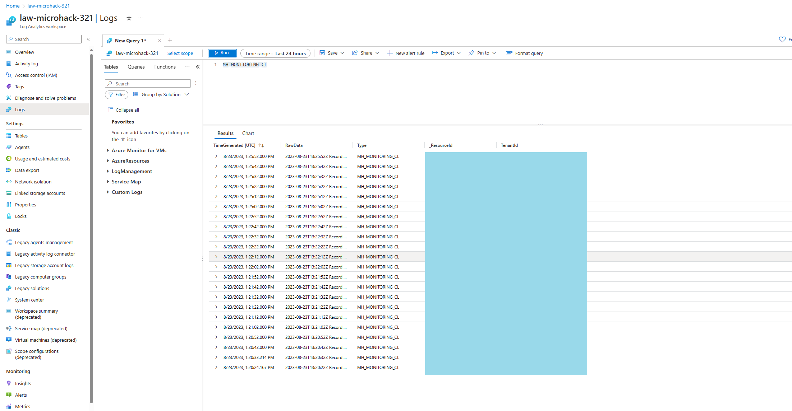

# Walkthrough Challenge 5

*Duration: 35 Minutes*

See detailed information - [Collect text logs with Azure Monitor Agent](https://learn.microsoft.com/en-us/azure/azure-monitor/agents/data-collection-text-log?tabs=portal)

### Task 1

- Create a `Data Collection Endpoint`

    

    

- Create a custom table named `MH_MONITORING_CL` inside Azure Log Analytics workspace `law-microhack`.

- This step will create a new custom table `MH_MONITORING_CL`, which is any table name that ends in _CL. Currently a direct REST call to the table management endpoint is used to create a table.

    The easiest way to make the REST call is from an Azure Cloud PowerShell command line (CLI). To open the shell, go to the Azure portal, press the Cloud Shell button, and select PowerShell. If this is your first-time using Azure Cloud PowerShell, you will need to walk through the one-time configuration wizard.

    

    Copy and paste the following script in to PowerShell to create the table in your workspace. Make sure to replace the {subscription}.

```powershell
$tableParams = @'
{
   "properties": {
       "schema": {
              "name": "{TableName}_CL",
              "columns": [
       {
                               "name": "TimeGenerated",
                               "type": "DateTime"
                       }, 
                      {
                               "name": "RawData",
                               "type": "String"
                      }
             ]
       }
   }
}
'@

Invoke-AzRestMethod -Path "/subscriptions/{subscription id}/resourcegroups/rg-microhack-monitoring/providers/microsoft.operationalinsights/workspaces/law-microhack/tables/MH_MONITORING_CL?api-version=2021-12-01-preview" -Method PUT -payload $tableParams

```





### Task 2

- Generate sample logs on your virutal machine.
- Find a sample script in `./script/generate-logs.ps1`

- Run script on `vm-windows`

```powershell
# This script writes a new log entry at the specified interval indefinitely.
# Usage:
# .\GenerateCustomLogs.ps1 [interval to sleep]
#
# Press Ctrl+C to terminate script.
#
# Example:
# .\ GenerateCustomLogs.ps1 5

param (
    [Parameter(Mandatory=$true)][int]$sleepSeconds
)

$logFolder = "c:\\JavaLogs"
if (!(Test-Path -Path $logFolder))
{
    mkdir $logFolder
}

$logFileName = "TestLog-$(Get-Date -format yyyyMMddhhmm).log"
do
{
    $count++
    $randomContent = New-Guid
    $logRecord = "$(Get-Date -format s)Z Record number $count with random content $randomContent"
    $logRecord | Out-File "$logFolder\\$logFileName" -Encoding utf8 -Append
    Start-Sleep $sleepSeconds
}
while ($true)
```

### Task 3

- Create a `Data Collection Endpoint` and a `Data Collection Rule` to gather text logs from the virtual machine `vm-windows`

    

    

    

### Task 4

- Verify custom table `MH_MONITORING_CL` and logs are gather in Log Analytics workspace `law-microhack`.
  
    